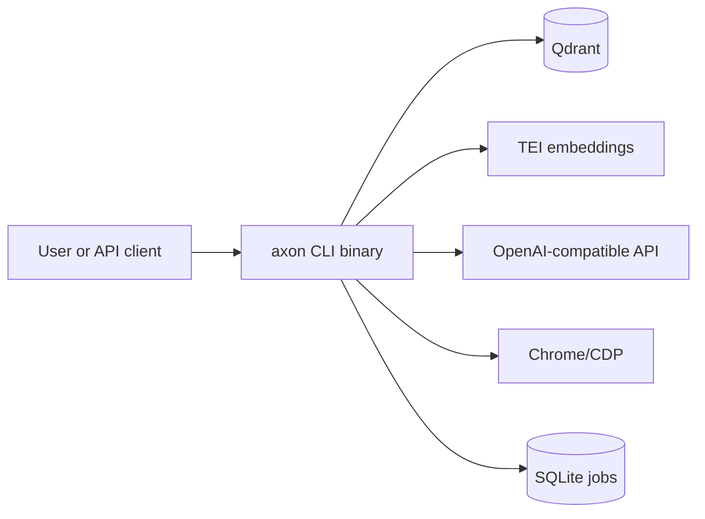
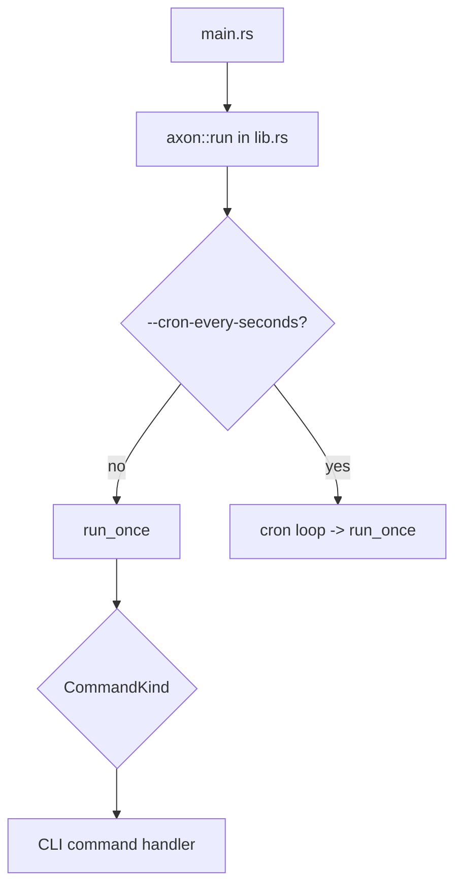
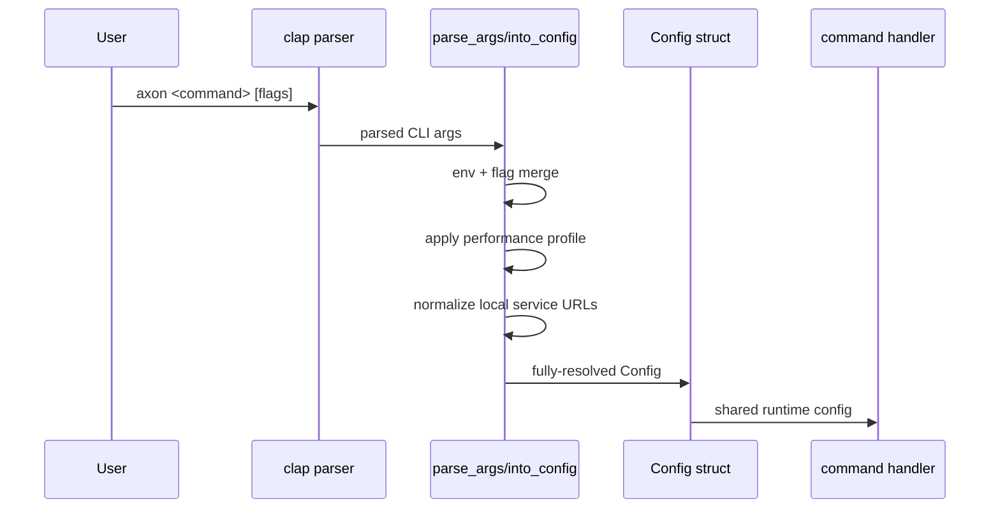
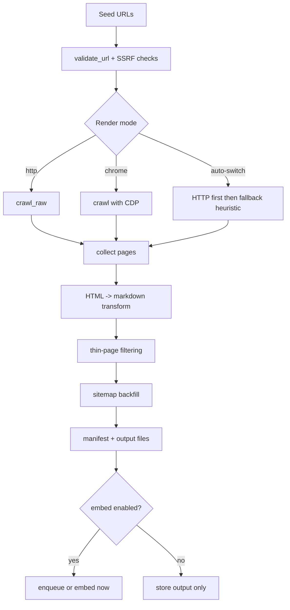
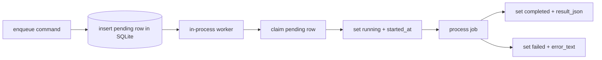
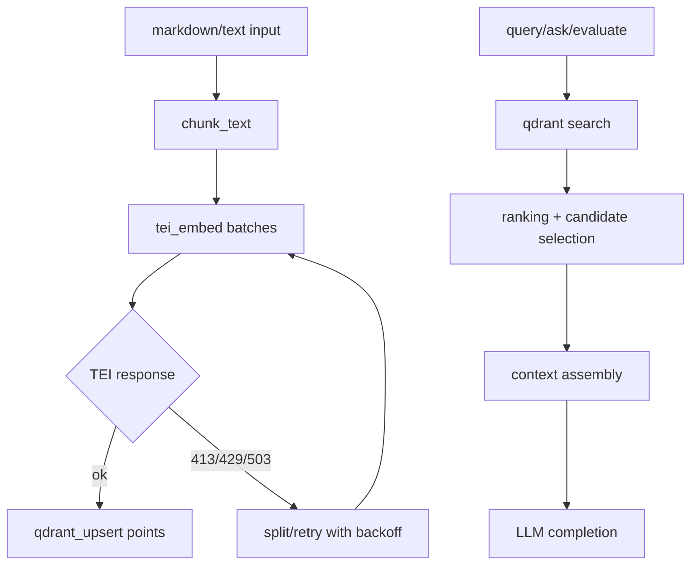
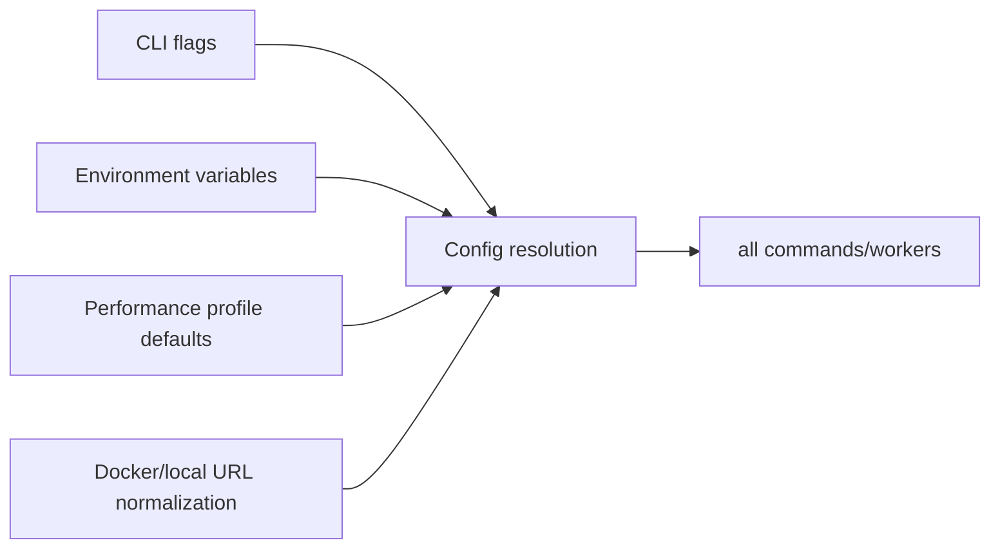

# Axon Architecture
Last Modified: 2026-05-06

Version: 1.0.0
Last Updated: 01:26:53 | 02/25/2026 EST

## Table of Contents

1. [Purpose and Scope](#purpose-and-scope)
2. [System Context](#system-context)
3. [Runtime Components](#runtime-components)
4. [Execution Entry Points](#execution-entry-points)
5. [CLI and Config Flow](#cli-and-config-flow)
6. [Crawl and Content Pipeline](#crawl-and-content-pipeline)
7. [Async Job Architecture](#async-job-architecture)
8. [Vector and RAG Pipeline](#vector-and-rag-pipeline)
9. [Ingest Pipeline](#ingest-pipeline)
10. [Web Runtime Architecture](#web-runtime-architecture)
11. [Data Model and Persistence](#data-model-and-persistence)
12. [Configuration Resolution](#configuration-resolution)
13. [Failure Handling and Recovery](#failure-handling-and-recovery)
14. [End-to-End Flows](#end-to-end-flows)
15. [Key Source Map](#key-source-map)

## Purpose and Scope

This document defines the current architecture of `axon_rust` across:

- CLI command execution and dispatch
- Crawl/extract/embed/ingest asynchronous pipelines
- Vector storage and retrieval (Qdrant + TEI)
- Unified HTTP runtime (`axon serve` web panel, MCP, `/v1/ask`, `/v1/actions`)
- CLI client/server data flow

It supersedes the previous architecture notes for the removed omnibox/Pulse web
runtime.

## System Context



## Runtime Components

| Component | Role |
|---|---|
| `main.rs` + `lib.rs` | Binary entry and top-level command loop/dispatch |
| `src/cli/*` | Command handlers and subcommand routing |
| `src/core/*` | Config parsing, HTTP safety, content transforms, logging |
| `src/crawl/*` | Crawl engine, render mode strategy, sitemap backfill |
| `src/jobs/*` | SQLite-backed worker runtime + job state transitions |
| `src/vector/*` | Embed/query/retrieve/ask/evaluate/suggest operations |
| `src/services/llm_backend/` | Gemini headless completion gateway, process isolation, timeout, concurrency, env allowlist |
| `docker-compose.yaml` | Self-hosted infrastructure services (Qdrant, TEI, Chrome) |

## Execution Entry Points



- `main.rs` loads `.env` and invokes `axon::run`.
- `lib.rs` owns run-loop concerns (logging init, optional cron, dispatch to handlers).
- Command dispatch is centralized in `run_once` using `CommandKind`.

## CLI and Config Flow



Key points:

- Argument schema is defined in `src/core/config/cli.rs` and `src/core/config/cli/global_args.rs`.
- Parsing/normalization is in `src/core/config/parse.rs`.
- Effective runtime settings are stored in `src/core/config/types/config.rs::Config`.
- URL seed handling is consolidated in `src/cli/commands/common.rs` (`parse_urls`, `start_url_from_cfg`).

## Crawl and Content Pipeline



Key responsibilities:

- HTTP safety, SSRF guarding, and client setup in `src/core/http.rs`.
- Content transformation and markdown extraction in `src/core/content.rs`.
- Crawl orchestration in `src/crawl/engine.rs`.
- Auto-switch mode evaluates crawl quality and can rerun with Chrome.
- Sitemap backfill extends coverage beyond direct traversal.

### Map Command

`map` consumes a unified URL set from the crawl engine (`map_with_sitemap` in `src/crawl/engine.rs`).
The CLI no longer merges or deduplicates sitemap URLs itself — the engine owns the full URL set with
deterministic sort+dedup before returning `MapResult`. This keeps the CLI handler as a thin
delegation layer and ensures the output contract is tested at the engine level.

## Async Job Architecture

Jobs are persisted in SQLite. Workers run in-process within the same tokio runtime.



State model:

- Shared statuses in `src/jobs/status.rs`: `pending`, `running`, `completed`, `failed`, `canceled`.
- Atomic claim/fail/update helpers in `src/jobs/lite/ops/lifecycle.rs`.
- Queue-cap checks in `src/jobs/lite/ops/enqueue.rs`.
- Stale job reclaim in `src/jobs/lite/store.rs`.

Job families:

- Crawl: `src/jobs/lite/workers/runners/crawl.rs`
- Extract: `src/jobs/lite/workers/runners/extract.rs`
- Embed: `src/jobs/lite/workers/runners/embed.rs`
- Ingest: `src/jobs/lite/workers/runners/ingest.rs`

### Worker Architecture

#### In-Process SQLite Workers

`src/jobs/lite/workers.rs` provides the generic worker loop. Each lane claims a
pending row from SQLite, updates heartbeat state while running, calls the
per-kind runner, and records completion or failure.

Lane counts are resolved per job family, with ingest and embed exposing tuning
env vars. Each lane processes jobs sequentially.

#### Crawl Runner and Spider Control

The crawl runner wires cancellation into Spider control IDs so a canceled job can
stop dispatching new pages and record partial progress before the row reaches a
terminal state.

## Vector and RAG Pipeline



Key behaviors:

- Embedding implementation in `src/vector/ops/tei.rs`.
- Qdrant operations and collection lifecycle in `src/vector/ops/qdrant/*`.
- Command-level vector flows in `src/vector/ops/commands/*`.
- Ingest sources eventually call vector embedding paths so all content lands in Qdrant with metadata.

## Ingest Pipeline

### Unified Ingest Entry Point (v0.12.0)

`axon ingest <target>` replaces the three separate `github`, `reddit`, and `youtube` CLI commands. `src/ingest/classify.rs` auto-detects the source type from the target string:

```mermaid
flowchart TD
  A[axon ingest <target>] --> B[classify_target]
  B -->|r/ prefix or reddit.com| C[IngestSource::Reddit]
  B -->|@handle / known YT host / 11-char ID| D[IngestSource::YouTube]
  B -->|github.com or owner/repo| E[IngestSource::GitHub]
  C --> F[src/ingest/reddit.rs]
  D --> G[src/ingest/youtube.rs]
  E --> H[src/ingest/github.rs]
  F --> I[embed_prepared_docs -> Qdrant]
  G --> I
  H --> I
```

Detection order: Reddit → YouTube → GitHub (first match wins).

### Ingest Submodule Layout

```text
src/ingest/
├── classify.rs          # auto-detection: classify_target()
├── github.rs            # module root
├── github/
│   ├── files.rs         # file tree fetch + raw content
│   ├── issues.rs        # octocrab paginated issues + PRs
│   ├── meta.rs          # gh_* structured metadata for Qdrant points (v0.12.0)
│   └── wiki.rs          # git clone --depth=1 wiki
├── reddit.rs            # module root
├── reddit/
│   ├── client.rs        # OAuth2 client credentials
│   ├── comments.rs      # recursive comment tree
│   ├── meta.rs          # reddit_* structured metadata for Qdrant points (v0.12.0)
│   └── types.rs         # Reddit API response types
├── youtube.rs           # module root
├── youtube/
│   ├── meta.rs          # yt_* structured metadata for Qdrant points (v0.12.0)
│   └── vtt.rs           # parse_vtt_to_text: yt-dlp VTT transcript parser
└── sessions.rs          # AI session export ingest
```

### MCP Artifacts Module (`src/mcp/server/artifacts/`)

Added in v0.12.0 to manage MCP tool response artifacts:

| File | Responsibility |
|---|---|
| `artifacts.rs` | Module root; `ArtifactStore` type |
| `artifacts/lifecycle.rs` | Create, expire, and garbage-collect artifacts |
| `artifacts/path.rs` | Artifact path resolution and URL generation |
| `artifacts/respond.rs` | Build MCP tool response payloads embedding artifact refs |
| `artifacts/shape.rs` | `ArtifactShape` enum: `Blob`, `Text`, `Json`, `Image` |

### LLM Backend (`src/services/llm_backend/`)

`services/llm_backend` is the sole LLM synthesis gateway. It serves `ask`,
`evaluate`, `suggest`, `research`, `debug`, and extract fallback by launching
Gemini headless with:

- isolated temporary HOME populated from `AXON_HEADLESS_GEMINI_HOME` or process HOME
- allowlisted environment variables
- command path validation
- `AXON_LLM_COMPLETION_CONCURRENCY` semaphore
- `AXON_LLM_COMPLETION_TIMEOUT_SECS` per-request timeout

Callers use `CompletionRequest` and `CompletionResponse`; no entry point should
spawn Gemini directly.

## Data Model and Persistence

Primary tables (SQLite, auto-created via `ensure_schema()`):

- `axon_crawl_jobs`
- `axon_extract_jobs`
- `axon_embed_jobs`
- `axon_ingest_jobs`

Common columns:

- `id`, `status`, `created_at`, `updated_at`, `started_at`, `finished_at`, `error_text`, `config_json`, `result_json`

Ingest-specific discriminator:

- `source_type` + `target` replace URL-based identifiers.

Storage responsibilities:

- SQLite: job metadata and lifecycle state
- Qdrant: vector points + retrieval corpus

## Configuration Resolution



Important behavior:

- Container DNS endpoints are normalized for local execution when needed.
- Profiles (`high-stable`, `balanced`, `extreme`, `max`) apply batch, timeout, retry, and concurrency defaults.
- Collection names and worker/concurrency knobs are centrally configurable.

## Failure Handling and Recovery

Resilience patterns implemented:

- Atomic row claiming prevents duplicate worker ownership.
- Watchdog can reclaim stale `running` jobs.
- Embedding retries handle transient TEI overload and payload limits.
- Service calls return typed errors and diagnostics for CLI, MCP, and HTTP callers.
- Job subcommands (`status`, `errors`, `list`, `recover`, `cancel`) provide operational control.

## End-to-End Flows

### 1) Crawl with Async Job

1. User runs `axon crawl <url>` (default async).
2. Command inserts a `pending` job row into SQLite.
3. Worker claims row, marks `running`, executes crawl.
4. Results and artifacts are written, optional embedding happens.
5. Job row is finalized with `completed` or `failed`.

### 2) Ask/RAG Query

1. User runs `axon ask <question>`, sends an MCP action, or calls the HTTP action API.
2. Query retrieves candidates from Qdrant.
3. Ranking/context assembly builds prompt context.
4. LLM endpoint generates final answer.

## Key Source Map

Core runtime:

- `main.rs`
- `lib.rs`
- `src/core/config/cli.rs`
- `src/core/config/cli/global_args.rs`
- `src/core/config/parse.rs`
- `src/core/config/types/config.rs`
- `src/core/config/types.rs`
- `src/core/http.rs`
- `src/core/content.rs`

Crawl/jobs/vector:

- `src/crawl/engine.rs`
- `src/jobs/status.rs`
- `src/jobs/lite.rs`
- `src/jobs/lite/workers.rs`
- `src/jobs/lite/ops/enqueue.rs`
- `src/jobs/lite/ops/lifecycle.rs`
- `src/jobs/lite/store.rs`
- `src/jobs/lite/workers/runners/{crawl,embed,extract,ingest}.rs`
- `src/vector/ops.rs`
- `src/vector/ops/tei.rs`

Ingest:

- `src/ingest/classify.rs`
- `src/ingest/github.rs` + `src/ingest/github/` (files, issues, meta, wiki)
- `src/ingest/reddit.rs` + `src/ingest/reddit/` (client, comments, meta, types)
- `src/ingest/youtube.rs` + `src/ingest/youtube/` (meta, vtt)
- `src/ingest/sessions.rs`

LLM backend:

- `src/services/llm_backend.rs`
- `src/services/llm_backend/concurrency.rs`
- `src/services/llm_backend/headless/dispatch.rs`
- `src/services/llm_backend/headless/env.rs`
- `src/services/llm_backend/headless/gemini.rs`
- `src/services/llm_backend/types.rs`
- `src/mcp/server/artifacts.rs`
- `src/mcp/server/artifacts/` (lifecycle, path, respond, shape)

## Security: Destructive Operations

The following CLI operations are **unauthenticated** — any process with access to
the SQLite database can invoke them:

- `axon crawl clear` — deletes ALL crawl jobs
- `axon extract clear` — deletes ALL extract jobs
- `axon crawl cancel <id>` — cancels a specific job

**Accepted risk**: Axon is a self-hosted single-user tool. The SQLite database is a
local file. Qdrant is bound to `127.0.0.1` (or internal Docker network). External
exposure is prevented at the infrastructure layer (Docker port mappings, Tailscale ACLs).

---

If this architecture changes, update this file in the same PR as the behavior change.
