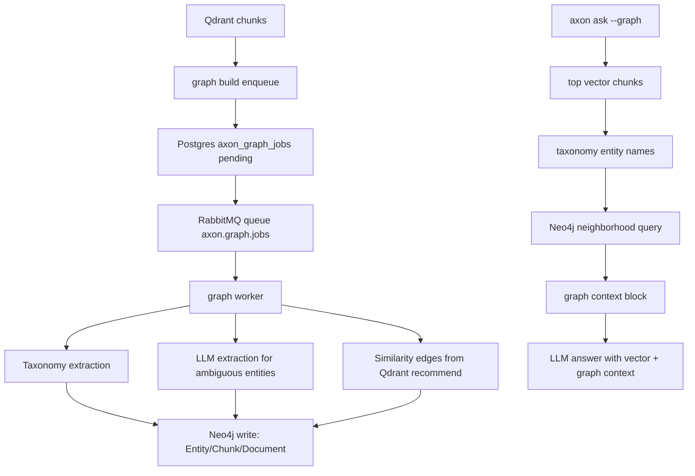

# Graph Features (Neo4j + Graph-Enhanced Ask)
Last Modified: 2026-03-20

Version: 1.0.0
Last Updated: 17:20:00 | 03/20/2026 EST

## Table of Contents

1. Purpose
2. What Exists Today
3. Architecture Overview
4. Data Model (Neo4j)
5. Async Job Flow (`axon_graph_jobs`)
6. CLI Reference (`axon graph`)
7. `ask --graph` Behavior
8. MCP Graph API
9. Configuration
10. Operations and Troubleshooting
11. Limits and Guardrails
12. Source Map

## Purpose

This document is the canonical, code-accurate reference for Axon's graph features:

- Neo4j-backed entity/document graph extraction
- Async graph worker pipeline
- Graph exploration and stats
- Graph-enhanced RAG context for `axon ask --graph`
- MCP graph action support (`action: "graph"`)

## What Exists Today

Graph functionality is fully implemented and available through:

- CLI command family: `axon graph`
- Background worker: `axon graph worker`
- Service layer: `crates/services/graph.rs`
- MCP action: `action: "graph"` with subactions `build|status|explore|stats`
- Ask integration: global `--graph` flag (`cfg.ask_graph`) with graceful vector-only fallback

Graph features are opt-in and gated by `AXON_NEO4J_URL`.

## Architecture Overview



### Core Components

- Neo4j client: `crates/core/neo4j.rs`
- Graph job table + Neo4j constraints: `crates/jobs/graph/schema.rs`
- Graph worker: `crates/jobs/graph/worker.rs`
- Graph context builder for ask: `crates/jobs/graph/context.rs`
- Service entry points: `crates/services/graph.rs`
- CLI shim: `crates/cli/commands/graph.rs`
- MCP handler: `crates/mcp/server/handlers_graph.rs`

## Data Model (Neo4j)

### Nodes

- `Document { url, source_type, collection, updated_at }`
- `Chunk { point_id, url, collection, chunk_index, updated_at }`
- `Entity { name, entity_type, confidence, updated_at, description? }`

### Relationships

- `(Chunk)-[:BELONGS_TO]->(Document)`
- `(Entity)-[:MENTIONED_IN]->(Chunk)`
- `(Entity)-[:RELATES_TO { relation, updated_at }]->(Entity)`
- `(Document)-[:SIMILAR_TO { score, target_source_type, updated_at }]->(Document)`

### Neo4j Constraints/Indexes

Created by `ensure_neo4j_schema`:

- Unique `Entity.name`
- Unique `Document.url`
- Index `Chunk.point_id`
- Index `Entity.entity_type`

## Async Job Flow (`axon_graph_jobs`)

### Table

`axon_graph_jobs` fields include:

- identity and state: `id`, `url`, `status`, timestamps
- extraction counters: `chunk_count`, `entity_count`, `relation_count`
- payloads: `result_json`, `config_json`
- failure text: `error_text`

### Enqueue

Graph jobs are enqueued by:

- `axon graph build ...` (explicit)
- embed worker auto-enqueue when all are true:
  - `AXON_NEO4J_URL` is non-empty
  - embed input is a valid URL
  - enqueue succeeds

Enqueue includes advisory lock + dedupe logic to avoid duplicate active jobs per URL.

### Worker Execution

For each claimed job:

1. Load URL and source metadata from `config_json`
2. Load taxonomy (built-in or `AXON_GRAPH_TAXONOMY_PATH`)
3. Pull chunks by URL from Qdrant
4. Extract entities via taxonomy
5. For ambiguous entities, optionally run LLM extraction (`AXON_GRAPH_LLM_URL`)
6. Write documents/chunks/entities/relations to Neo4j
7. Compute and write similarity edges (`SIMILAR_TO`)
8. Mark job complete with counters in `result_json`

If Neo4j is not configured, worker startup fails fast.

## CLI Reference (`axon graph`)

### Subcommands

```bash
axon graph build [<url> | --url <url>] [--domain <domain>] [--all]
axon graph status
axon graph explore <entity>
axon graph stats
axon graph worker
```

### Behavior Notes

- `axon graph` with no subcommand is an error (non-zero exit)
- `build` requires at least one target selector:
  - single URL
  - domain
  - `--all`
- `build` enqueues jobs; worker processes jobs asynchronously
- `explore` enforces input guards:
  - trimmed non-empty
  - max 1000 chars

### Output

- Human output: concise summaries
- JSON output (`--json`): raw payloads

## `ask --graph` Behavior

`--graph` is a global flag. During ask:

1. Standard vector retrieval runs first
2. If `ask_graph == true` and Neo4j URL is set, graph context attempt starts
3. Top chunk text is taxonomy-scanned for entity names
4. Neo4j neighborhood is queried for those entities
5. A bounded `Graph Context:` block is prepended to vector context

If Neo4j init or graph query fails, ask logs a warning and falls back to vector-only context.

### Graph Context Limits

- `AXON_GRAPH_CONTEXT_MAX_CHARS` controls max injected graph context
- Empty graph context is allowed and does not fail the ask request

## MCP Graph API

MCP supports graph operations directly:

```json
{ "action": "graph", "subaction": "build", "url": "https://example.com" }
{ "action": "graph", "subaction": "status" }
{ "action": "graph", "subaction": "explore", "entity": "Tokio" }
{ "action": "graph", "subaction": "stats" }
```

Notes:

- `graph build` requires one of `url`, `domain`, or `all=true`
- `graph explore` requires `entity`
- `response_mode` is supported like other MCP actions

## Configuration

### Required for graph features

```bash
AXON_NEO4J_URL=http://127.0.0.1:7474
AXON_NEO4J_USER=neo4j
AXON_NEO4J_PASSWORD=...
```

Important: Axon uses Neo4j's HTTP transactional Cypher endpoint (`/db/neo4j/tx/commit`).
Use an HTTP base URL, not a Bolt DSN.

### Optional graph tuning

```bash
AXON_GRAPH_QUEUE=axon.graph.jobs
AXON_GRAPH_CONCURRENCY=4
AXON_GRAPH_LLM_URL=http://localhost:11434
AXON_GRAPH_LLM_MODEL=qwen3.5:4b
AXON_GRAPH_SIMILARITY_THRESHOLD=0.75
AXON_GRAPH_SIMILARITY_LIMIT=20
AXON_GRAPH_CONTEXT_MAX_CHARS=2000
AXON_GRAPH_TAXONOMY_PATH=
```

## Operations and Troubleshooting

### Start worker

```bash
cargo run --bin axon -- graph worker
```

### Queue graph jobs

```bash
cargo run --bin axon -- graph build --url https://tokio.rs/tokio/tutorial
cargo run --bin axon -- graph status
```

### Common failures

- `graph operations require AXON_NEO4J_URL`:
  - set `AXON_NEO4J_URL`
- Neo4j auth failure:
  - verify `AXON_NEO4J_USER` and `AXON_NEO4J_PASSWORD`
- No graph context in ask:
  - confirm graph data exists (`axon graph stats`)
  - confirm `--graph` was passed and Neo4j is reachable

## Limits and Guardrails

- Graph build URL fetch caps in service layer:
  - `GRAPH_BUILD_URL_LIMIT = 50_000`
  - `GRAPH_BUILD_DOMAIN_FETCH_LIMIT = 500_000`
- Domain build filters by exact host or subdomain suffix match
- Graph table has status CHECK constraint
- Enqueue dedupes active graph jobs per URL via advisory lock

## Source Map

- CLI: `crates/cli/commands/graph.rs`
- Services: `crates/services/graph.rs`
- Neo4j client: `crates/core/neo4j.rs`
- Graph jobs: `crates/jobs/graph.rs`
- Graph worker: `crates/jobs/graph/worker.rs`
- Graph schema: `crates/jobs/graph/schema.rs`
- Ask graph context: `crates/jobs/graph/context.rs`
- MCP schema: `crates/mcp/schema.rs`
- MCP graph handler: `crates/mcp/server/handlers_graph.rs`
