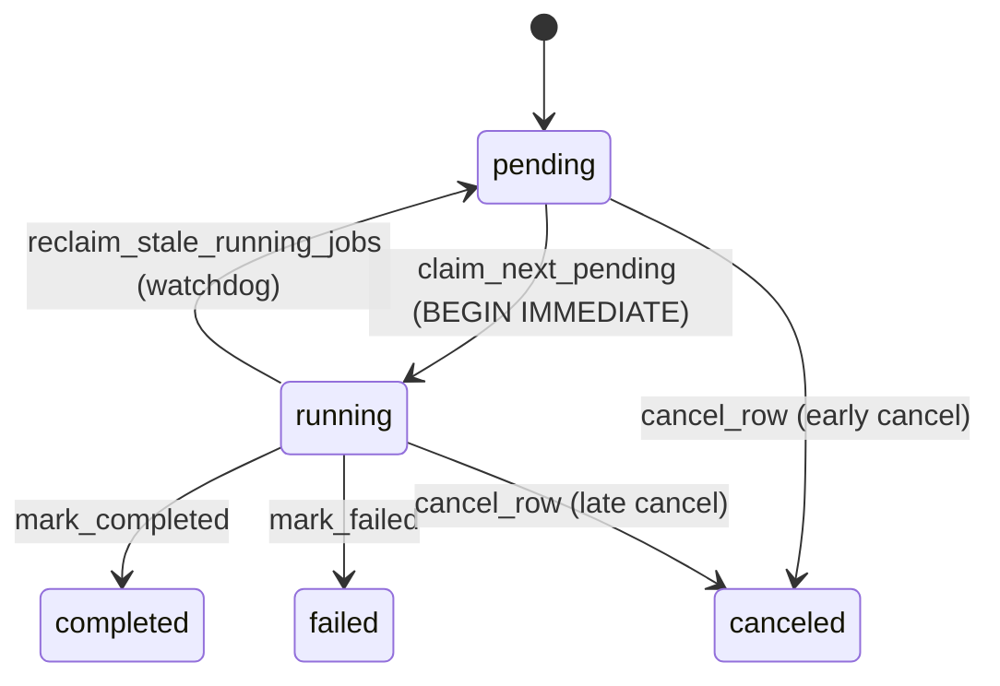

# Job Lifecycle
Last Modified: 2026-05-06

The async-job state machine for axon. Jobs use SQLite persistence and in-process tokio workers; there is no message broker, Postgres, or Redis runtime.

For module layout, helper-function index, and the `JobBackend` / `ServiceJobRuntime` distinction, see [`src/jobs/CLAUDE.md`](../src/jobs/CLAUDE.md) and [`src/services/CLAUDE.md`](../src/services/CLAUDE.md).

## Table of Contents

1. Scope
2. Job Kinds and Tables
3. State Machine
4. Enqueue Flow
5. Claim and Execute Flow
6. Cancellation Model
7. Stale-Job Recovery
8. Worker Runtime
9. Data Model
10. Operational Commands
11. Failure Modes
12. Source Map

## Scope

Four async job families are persisted in SQLite and processed by in-process workers spawned by `LiteBackend::new_with_workers`:

- **Crawl** — site/URL crawling (`src/jobs/lite/workers/runners/crawl.rs`)
- **Extract** — LLM structured extraction (`src/jobs/lite/workers/runners/extract.rs`)
- **Embed** — TEI embedding + Qdrant upsert (`src/jobs/lite/workers/runners/embed.rs`)
- **Ingest** — GitHub / Reddit / YouTube / sessions (`src/jobs/lite/workers/runners/ingest.rs`)

Refresh and graph job runners were removed with the legacy queue runtime. The migration `0001_create_tables.sql` still creates `axon_refresh_jobs` and `axon_graph_jobs` for historical compatibility, but no `JobKind`, runner, or service code references those tables.

Watch (recurring scheduler) is **not** part of `JobBackend`/`JobKind`. It is a separate SQLite-backed scheduler in `src/jobs/watch_lite.rs` whose CRUD shim lives in `src/services/watch.rs`. It dispatches into the four queues above when a watch fires.

## Job Kinds and Tables

`JobKind` (`src/jobs/backend.rs:20-40`) enumerates exactly four variants. There is one SQLite table per kind:

| `JobKind` | SQL table | Type-specific column(s) | Queue cap env var | Default cap |
|-----------|-----------|-------------------------|-------------------|-------------|
| `Crawl`   | `axon_crawl_jobs`   | `url TEXT`                              | `AXON_MAX_PENDING_CRAWL_JOBS`   | 100 |
| `Embed`   | `axon_embed_jobs`   | `input_text TEXT`                       | `AXON_MAX_PENDING_EMBED_JOBS`   | 50  |
| `Extract` | `axon_extract_jobs` | `urls_json TEXT` (JSON array)           | `AXON_MAX_PENDING_EXTRACT_JOBS` | 50  |
| `Ingest`  | `axon_ingest_jobs`  | `target TEXT`, `source_type TEXT`       | `AXON_MAX_PENDING_INGEST_JOBS`  | 50  |

`JobKind::table_name()` is the single source of truth for table names — never hardcode `"axon_*_jobs"` strings outside `enqueue.rs` (which interpolates compile-time `&'static str` literals; see safety note in `src/jobs/lite/ops/enqueue.rs:55-64`).

`JobPayload` (`src/jobs/backend.rs:43-62`) carries the per-kind body submitted to `enqueue`:

- `Crawl { url, config_json }`
- `Embed { input, config_json }`
- `Extract { urls: Vec<String>, config_json }`
- `Ingest { target, source_type, config_json }`

`config_json` is a worker-side configuration snapshot produced by `lite_config_snapshot_json()` (`src/jobs/lite/config_snapshot.rs`), so each job replays the submitter's non-secret config knobs irrespective of the worker's local environment.

## State Machine

Five statuses, defined in `JobStatus` (`src/jobs/status.rs:26-32`) and enforced by a SQL CHECK constraint (migration `0003_add_status_checks.sql`):

```
pending → running → { completed | failed | canceled }
pending → canceled                  (cancel before claim)
running → pending                   (stale-job reclaim only)
```



`JobStatus::from_str` falls back to `JobStatus::Failed` on unknown DB values and emits a `tracing::warn!` (`src/jobs/status.rs:55-69`) — corrupt status strings never crash the runtime.

### Column transitions

Every `axon_*_jobs` row carries the same lifecycle columns. The transitions are:

| Transition           | SQL written                                                                                          | Where                                                  |
|----------------------|------------------------------------------------------------------------------------------------------|--------------------------------------------------------|
| insert (pending)     | `status='pending'`, `created_at=now`, `updated_at=now`                                               | `enqueue_job` (`lite/ops/enqueue.rs`)                  |
| claim (→running)     | `status='running'`, `started_at=now`, `updated_at=now` *(guarded by `WHERE status='pending'`)*       | `claim_next_pending_inner` (`lite/ops/lifecycle.rs`)   |
| live progress        | `result_json=…`, `updated_at=now` *(no status change)*                                               | `update_result_json` (`lite/ops/lifecycle.rs`)         |
| complete             | `status='completed'`, `finished_at=now`, `updated_at=now`, `result_json=…` *(if provided)*           | `mark_completed_inner` (`lite/ops/lifecycle.rs`)       |
| fail                 | `status='failed'`, `finished_at=now`, `updated_at=now`, `error_text=…`                               | `mark_failed_inner` (`lite/ops/lifecycle.rs`)          |
| cancel               | `status='canceled'`, `finished_at=now`, `updated_at=now` *(guarded by `WHERE status IN ('pending','running')`)* | `cancel_row` (`lite/ops/lifecycle.rs`)                 |
| stale reclaim        | `status='pending'`, `error_text='reclaimed after unexpected shutdown'`, `updated_at=now` *(guarded by `WHERE status='running' AND updated_at<threshold`)* | `reclaim_stale_running_jobs_for_table` (`lite/store.rs`) |

`mark_completed` and `mark_failed` use `WHERE status='running'` so a row that was canceled mid-execution stays in `canceled` — the worker's terminal write is logged as a warning and silently dropped (`lite/ops/lifecycle.rs:138-145`, `200-207`).

## Enqueue Flow

`LiteBackend::enqueue` (`src/jobs/lite.rs:124-134`):

1. `JobPayload::kind()` selects the target table.
2. `enqueue_job()` checks the per-kind queue cap via `check_pending_cap_for()` (`lite/ops/enqueue.rs:65-87`).
   - `cap == 0` → unlimited; check is skipped.
   - `cap > 0` and `pending_count >= cap` → returns `JobError::QueueCapacityExceeded { kind, cap, current }`.
   - The cap value is parsed once at process start with `LazyLock` and `parse_cap_env`. A non-numeric env value logs `tracing::warn!` and falls back to the default.
3. Insert row with `status='pending'`, fresh UUID, `created_at`/`updated_at = now_ms()`.
4. Returns the new `JobId` (`Uuid`).
5. If the backend has workers (`new_with_workers` mode), `WorkerHandles::notify(kind)` fires the per-kind `Notify` so the lane wakes immediately instead of waiting for the next 5 s poll.

The auto-embed handoff inside the crawl runner (`runners/crawl.rs:61-103`) also flows through `enqueue_job`, so the embed cap applies even to internally-chained jobs. When the embed cap rejects the chain, the crawl result JSON includes `"embed_deferred"` with a human-readable reason and the markdown is left on disk unindexed.

## Claim and Execute Flow

The single claim primitive — used by every worker lane — is `claim_next_pending` (`src/jobs/lite/ops/lifecycle.rs:15-88`):

1. Acquire a SQLite connection from the pool.
2. `BEGIN IMMEDIATE` — under WAL this acquires the write lock up front, serializing concurrent claims atomically and removing the SELECT/UPDATE TOCTOU window between lanes.
3. `SELECT id FROM <table> WHERE status='pending' ORDER BY created_at LIMIT 1`.
4. `UPDATE … SET status='running', started_at=?, updated_at=? WHERE id=? AND status='pending'`. The `AND status='pending'` predicate is the second-line defence — if a different lane somehow claimed it first the update affects 0 rows and the call returns `Ok(None)`.
5. `COMMIT` (or `ROLLBACK` on any error).

Lock-contention errors (`database is locked`, `database table is locked`) are swallowed by `retry_busy` (`lite/ops/retry.rs`) up to 5 attempts with exponential backoff starting at 25 ms.

Once a worker holds an `Uuid`, `worker_loop` (`src/jobs/lite/workers.rs:170-238`) drives the per-kind runner:

- **Ok(`Some(result_json)`)** → `mark_completed(pool, kind, id, result_json)`.
- **Ok(`None`)** → `mark_completed(pool, kind, id, None)`. Returned when the row was deleted between claim and execute (e.g. `axon … clear` mid-run); a warn is logged.
- **Err(e)** → `mark_failed(pool, kind, id, &e.to_string())`.

Any failure in `mark_completed`/`mark_failed` itself is logged at `error` level and leaves the row in `running` — the next stale-job sweep on process restart will repair it.

A worker processes up to `WORKER_BATCH_LIMIT = 32` jobs per wake before yielding (`workers.rs:36`, `188-235`); shutdown is checked between jobs and between batches.

### Live progress writes

Long-running jobs persist progress through `update_result_json` without changing status:

- **Crawl** uses `spawn_crawl_progress_persister` (`workers/progress.rs:9-28`). The crawl engine sends `CrawlSummary` on a 32-slot mpsc channel; the persister updates `result_json` after each message.
- **Embed** uses `spawn_embed_progress_persister` (`workers/progress.rs:30-48`) keyed off `EmbedProgress` from `vector::ops::tei`.
- **Extract** and **ingest** runners write progress directly via `update_result_json` from inside their bodies.

Because progress writes update `updated_at`, they double as a heartbeat that prevents the watchdog from flagging an actively-progressing job as stale.

## Cancellation Model

Cancellation is **in-process only** for the current worker runtime (see `src/jobs/lite/cancel.rs:9-12`). There is no Redis flag and no cross-process polling.

`CancelStore` (`src/jobs/lite/cancel.rs`) is a `DashMap<Uuid, CancellationToken>`. Two paths of consumption:

1. **DB row update** — `cancel_row` flips `status` to `canceled` (gated `WHERE status IN ('pending','running')`).
2. **In-memory token** — runners that registered a token via `cancel_store.register(id)` observe `token.is_cancelled()` mid-execution and abort cleanly.

All active runners register a cancel token for claimed jobs. Crawl observes cancellation at the runner boundary, sends `spider::utils::shutdown("{job_id}{url}")` to the active Spider control target, waits briefly for drain, and returns canceled. Crawl progress JSON written before cancellation remains on the row, including output paths and counts when available. Extract and ingest check cancellation inside their loops or per-target futures; embed observes cancellation at the runner boundary.

`CancelStore::cancel(id, pool, kind)` performs both writes and returns `true` when the row update affected at least one row.

## Stale-Job Recovery

axon detects dead workers by tracking `updated_at` on `running` rows. Reclaim
runs at startup, on the periodic worker watchdog tick, and through explicit
`recover` subcommands.

### Startup sweep

`LiteBackend::init` (`src/jobs/lite.rs:34-43`) runs on every `LiteBackend::new` / `new_with_workers` boot:

```rust
let stale_threshold_ms =
    (cfg.watchdog_stale_timeout_secs + cfg.watchdog_confirm_secs).max(0) * 1_000;
store::reclaim_stale_running_jobs(&pool, stale_threshold_ms).await?;
store::reclaim_stale_watch_leases(&pool).await?;
```

`reclaim_stale_running_jobs` iterates `JobKind::all()` and for each table runs:

```sql
UPDATE <table>
   SET status='pending',
       error_text='reclaimed after unexpected shutdown',
       updated_at=?
 WHERE status='running'
   AND updated_at < (now_ms - stale_threshold_ms);
```

(`src/jobs/lite/store.rs:90-130`.)

Reclaimed jobs go back to `pending` so the next claim cycle picks them up. The previous `error_text` is overwritten with the marker string. `started_at` and `finished_at` are not touched.

The same function powers `axon … recover`, which `ServiceJobRuntime::recover_jobs` (`src/services/runtime.rs:239-248`) wires through to `reclaim_stale_running_jobs_for_table` for a single kind.

### Threshold knobs

| Env var                          | Field                          | Default | Floor |
|----------------------------------|--------------------------------|---------|-------|
| `AXON_JOB_STALE_TIMEOUT_SECS`    | `watchdog_stale_timeout_secs`  | 300     | 30    |
| `AXON_JOB_STALE_CONFIRM_SECS`    | `watchdog_confirm_secs`        | 60      | 10    |

Effective threshold = `(timeout + confirm) * 1_000` ms (default **360 s**). Floors are applied in `src/core/config/parse/build_config.rs:447-448` to prevent dangerously short windows from being configured.

### Crash semantics

If a process dies mid-job:

1. The `running` row's `updated_at` stops advancing.
2. After 360 s (default), the next startup, periodic watchdog tick, or explicit
   `recover` command sweeps it back to `pending`.
3. A worker re-claims it on the next poll.

There is no two-pass `_watchdog` confirmation marker today — the single timeout/confirm sum is the only window. Any caller that needs continuous reclaim during a long-lived process must explicitly invoke `axon <kind> recover` (or call `recover_jobs` through the service runtime).

### Watch leases

`reclaim_stale_watch_leases` (`store.rs:136-145`) clears `lease_expires_at` on `axon_watch_defs` rows whose lease has already expired, so the watch scheduler in `src/jobs/watch_lite.rs` can re-acquire them on the next tick.

## Worker Runtime

In-process workers live entirely in `src/jobs/lite/workers.rs` plus the runner modules under `lite/workers/runners/`. Spawned only by `LiteBackend::new_with_workers`; never by `LiteBackend::new`.

```
spawn_workers (workers.rs:79)
├─ crawl_worker        (1 lane — spider futures are !Send)
├─ embed_worker        (N lanes; AXON_EMBED_LANES; CPU-scaled default 2..=32)
├─ extract_worker      (1 lane)
└─ ingest_worker       (N lanes; AXON_INGEST_LANES; CPU-scaled default 2..=16)
```

Lane count is resolved by `resolve_lane_count(env, cpu_min, cpu_max)` (`workers.rs:23-33`): env wins; otherwise `available_parallelism()` clamped to `[cpu_min, cpu_max]`.

Each lane runs `worker_loop` (`workers.rs:170-238`):

```text
loop {
    select! {
        notify.notified() | sleep(POLL_INTERVAL=5s) | shutdown.cancelled()
    }
    while processed < 32 && !shutdown {
        match claim_next_pending() {
            Some(id) => { run_job(id); mark_completed/mark_failed; processed += 1 }
            None => break,
            Err  => break (logged),
        }
    }
}
```

- All lanes for a kind share the same `Arc<Notify>`. `notify_one()` wakes exactly one waiting lane; SQLite `BEGIN IMMEDIATE` serializes claim attempts, so no semaphore is needed.
- Crawl is forced to a single lane because spider's chrome futures are `!Send` and cannot be moved between tokio worker threads.
- After auto-enqueueing an embed job, the crawl runner pings `embed_notify` so the embed lane wakes without waiting for the 5 s poll.
- `Drop` for `WorkerHandles` cancels the shutdown token and `notify_waiters()` on every lane — joining the worker tasks is graceful: a lane finishes its current job (terminal mark included) before exiting.

`AXON_JOB_WAIT_TIMEOUT_SECS` (default 300 s) bounds `JobBackend::wait_for_job`, used by CLI commands invoked with `--wait true`.

## Data Model

Schema is created by sqlx migrations under `src/jobs/lite/migrations/`:

- `0001_create_tables.sql` — creates the four active tables plus the legacy-but-unused `axon_refresh_jobs` and `axon_graph_jobs` tables.
- `0002_create_watch_tables.sql` — `axon_watch_defs`, `axon_watch_runs`, `axon_watch_run_artifacts` (used by `watch_lite.rs`).
- `0003_add_status_checks.sql` — adds the `status IN (...)` CHECK constraint to every job table.

Common columns on every active job table:

```
id          TEXT PRIMARY KEY            -- UUIDv4
status      TEXT NOT NULL DEFAULT 'pending'
config_json TEXT NOT NULL DEFAULT '{}'
result_json TEXT                          -- live progress + final summary
error_text  TEXT                          -- failure reason / reclaim marker
created_at  INTEGER NOT NULL              -- unix millis
updated_at  INTEGER NOT NULL              -- bumped on every mutation
started_at  INTEGER                       -- set on claim
finished_at INTEGER                       -- set on terminal mark
```

Plus an `idx_<kind>_status` index on `status` (used by `claim_next_pending` and the cap query).

Per-kind columns:

| Table              | Extra columns                              |
|--------------------|--------------------------------------------|
| `axon_crawl_jobs`  | `url TEXT NOT NULL DEFAULT ''`             |
| `axon_embed_jobs`  | `input_text TEXT NOT NULL DEFAULT ''`      |
| `axon_extract_jobs`| `urls_json TEXT NOT NULL DEFAULT '[]'`     |
| `axon_ingest_jobs` | `source_type TEXT NOT NULL DEFAULT ''`, `target TEXT NOT NULL DEFAULT ''` |

`SqliteConnectOptions` set in `open_sqlite_pool` (`store.rs:43-53`):

- `journal_mode = WAL`
- `busy_timeout = 5000`
- `foreign_keys = ON`
- pool: `max_connections = 8`, `acquire_timeout = 30s`

The DB file is pre-created at mode `0o600` with `O_NOFOLLOW` to close the TOCTOU window where it could be world-readable (`store.rs:28-41`).

## Operational Commands

Each kind exposes the same job-management subcommands. Invocation: `axon <kind> <subcommand>`.

| Subcommand         | Service entry point                              | Effect |
|--------------------|--------------------------------------------------|--------|
| `status <id>`      | `ServiceJobRuntime::job_status`                  | Read row → `ServiceJob` |
| `cancel <id>`      | `ServiceJobRuntime::cancel_job`                  | DB flip + in-memory token (where applicable) |
| `errors <id>`      | `JobBackend::job_errors`                         | Read `error_text` |
| `list`             | `lite_query::list_jobs` (paginated)              | Most-recent 500, summary view |
| `cleanup`          | `lite_query::cleanup_jobs`                       | Delete `completed`/`failed` older than 24 h |
| `clear`            | `lite_query::clear_jobs`                         | Delete every row in the table |
| `recover`          | `ServiceJobRuntime::recover_jobs`                | Reclaim stale `running` rows for that kind |
| `worker`           | `ServiceJobRuntime::run_worker`                  | In-process: drains the queue then exits |

The four ingest source aliases (`axon github`, `axon reddit`, `axon youtube`, `axon sessions`) all route through `JobKind::Ingest` and share the `axon_ingest_jobs` table — the `source_type` column distinguishes them.

`--wait true` on a submit command (`crawl`, `extract`, `embed`, `ingest`) constructs a `LiteBackend` with workers, enqueues the job, and polls `wait_for_job` until terminal — bounded by `AXON_JOB_WAIT_TIMEOUT_SECS`.

## Failure Modes

| Layer | Symptom | Root cause | Recovery |
|-------|---------|-----------|----------|
| Worker panic / OOM / kill -9 | Row stuck in `running`, `updated_at` not advancing | Process died mid-job | Stale-job sweep on next boot or `axon <kind> recover` |
| Claim collision under load | `database is locked` | Two lanes raced `BEGIN IMMEDIATE` | `retry_busy` retries up to 5× with 25 ms..400 ms backoff |
| `mark_completed` 0 rows | `mark_completed: job row not found or not in running state` warn | Row was canceled or deleted mid-run | None needed — terminal state already correct |
| Queue cap reached | `JobError::QueueCapacityExceeded { kind, cap, current }` | `pending` count ≥ cap | Wait for workers to drain or raise the env var (`0` = unlimited) |
| Auto-embed deferred | Crawl `result_json.embed_deferred` populated; markdown unindexed | Embed queue at capacity when crawl finished | Drain embed queue, then re-embed the markdown directory manually |
| `wait_for_job` timeout | `job <id> timed out after Ns in state running` | Job exceeded `AXON_JOB_WAIT_TIMEOUT_SECS` | Continue polling via `axon <kind> status <id>`; raise the env var or run with `--wait false` |
| Crawl runner row-missing | `job row not found at execution time, may have been deleted mid-run` warn | Row deleted between claim and execute (e.g. `clear`) | None — runner returns `Ok(None)` and `mark_completed` no-ops |
| Cancel of mid-flight crawl/extract/embed | Row goes `canceled`; runner returns canceled at its safe interruption point | In-flight network or browser work may need a short drain window; crawl also sends Spider shutdown | Continue with `status`; partial crawl progress JSON is retained when it was already persisted |
| Unknown status string in DB | `unknown job status value in DB — treating as Failed` warn | DB hand-edited or schema drift | Restore via SQL or run a fresh DB |

## Source Map

Active code:

- `src/jobs/backend.rs` — `JobBackend` trait, `JobKind`, `JobPayload`, `JobStatusRow`, `JobSummary`, `wait_for_job`
- `src/jobs/status.rs` — `JobStatus` enum + `from_str`/`as_str`
- `src/jobs/error.rs` — `JobError` (`Db`, `JobNotFound`, `AlreadyClaimed`, `Timeout`, `QueueCapacityExceeded`, `Other`)
- `src/jobs/lite.rs` — `LiteBackend::{new, new_with_workers, new_with_path, init}` and `JobBackend` impl
- `src/jobs/lite/store.rs` — `open_sqlite_pool`, `reclaim_stale_running_jobs`, `reclaim_stale_running_jobs_for_table`, `reclaim_stale_watch_leases`, `now_ms`
- `src/jobs/lite/cancel.rs` — `CancelStore` (in-memory token map)
- `src/jobs/lite/ops/enqueue.rs` — `enqueue_job`, `check_pending_cap_for`, queue-cap `LazyLock` statics
- `src/jobs/lite/ops/lifecycle.rs` — `claim_next_pending`, `mark_completed`, `mark_failed`, `cancel_row`, `update_result_json`
- `src/jobs/lite/ops/retry.rs` — `retry_busy` for transient SQLite lock contention
- `src/jobs/lite/query.rs` — `list_jobs`, `count_jobs`, `cleanup_jobs`, `clear_jobs`, `job_status_row`, `job_errors`
- `src/jobs/lite/workers.rs` — `spawn_workers`, `worker_loop`, `WorkerHandles`, `resolve_lane_count`
- `src/jobs/lite/workers/runners/{crawl,embed,extract,ingest}.rs` — per-kind runner bodies
- `src/jobs/lite/workers/progress.rs` — crawl/embed progress persisters
- `src/jobs/lite/config_snapshot.rs` — submitter→worker config snapshotting
- `src/jobs/lite/migrations/` — `0001_create_tables.sql`, `0002_create_watch_tables.sql`, `0003_add_status_checks.sql`
- `src/jobs/watch_lite.rs` — recurring watch scheduler (separate state machine, not a `JobKind`)
- `src/services/runtime.rs` — `ServiceJobRuntime` trait + `LiteServiceRuntime` (`recover_jobs`, `notify_worker`, `drain_jobs`, `count_jobs`)
- `src/services/jobs.rs` — `recover_jobs(ctx, kind)` shim used by CLI/MCP

Companion docs:

- `src/jobs/CLAUDE.md` — module layout, helper-function index, and `JobBackend` vs `ServiceJobRuntime` rationale
- `src/services/CLAUDE.md` — services-first contract, `ServiceContext`, `LiteBackend` worker split

Legacy (kept for archaeological reasons; no live code references):

- `axon_refresh_jobs`, `axon_graph_jobs` (defined in `0001_create_tables.sql`)
